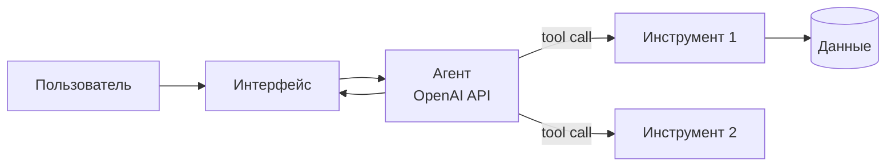

# Архитектура

## Компоненты
| Компонент | Ответственность | Технология |
|---|---|---|
| Интерфейс | _TBD_ | _TBD_ |
| Агент | планирование, вызов инструментов | OpenAI API |
| Инструменты | _TBD_ | _TBD_ |
| Хранилище | _TBD_ | _TBD_ |

## Решения и компромиссы
- _TBD_
